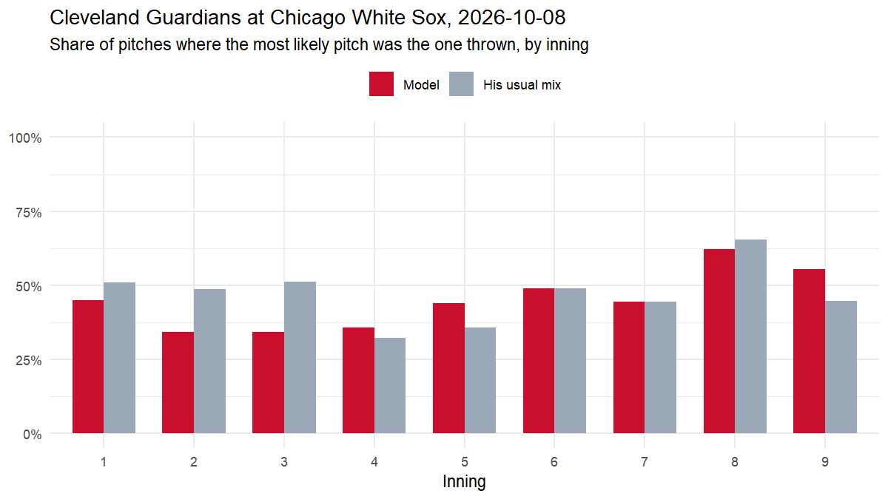

# Live test: Cleveland Guardians at Chicago White Sox, 2026-10-08

*Game 849832. Every prediction uses only what was known before the pitch. 0 of 368 predictions were logged live, before the pitch was thrown; the rest were backfilled from the pre-pitch state.*

| pitches | predicted live | model top-1 | his usual mix top-1 | model family | usual mix family | model log loss | usual mix log loss |
|---|---|---|---|---|---|---|---|
| 368 | 0 | 44.8% | 46.5% | 55.4% | 54.9% | 1.180 | 1.214 |

## By pitcher

| pitcher_name | pitches | model top-1 | usual top-1 | model log loss |
|---|---|---|---|---|
| Parker Messick | 65 | 40% | 45% | 1.25 |
| Erick Fedde | 61 | 30% | 49% | 1.41 |
| Cade Smith | 31 | 61% | 68% | 0.70 |
| Hagen Smith | 27 | 52% | 48% | 1.03 |
| Tyler Davis | 27 | 44% | 44% | 1.05 |
| Shawn Armstrong | 19 | 37% | 37% | 1.10 |
| Gavin Williams | 18 | 72% | 39% | 1.02 |
| Grant Taylor | 18 | 22% | 22% | 1.79 |
| Erik Sabrowski | 17 | 88% | 88% | 0.46 |
| Bryan Hudson | 16 | 38% | 38% | 1.08 |
| Hunter Gaddis | 16 | 38% | 38% | 1.26 |
| Tanner Bibee | 15 | 47% | 40% | 1.64 |
| Jordan Hicks | 14 | 36% | 21% | 1.23 |
| Tim Herrin | 13 | 54% | 46% | 1.22 |
| Anthony Kay | 11 | 55% | 55% | 1.32 |

## Most confident correct calls

| inning | pitcher | batter | count | predicted | thrown |
|---|---|---|---|---|---|
| bottom 6 | Erik Sabrowski | Tristan Peters | 3-0 | Four-seam 99% | Four-seam |
| bottom 9 | Cade Smith | Miguel Vargas | 2-0 | Four-seam 96% | Four-seam |
| top 1 | Hagen Smith | Steven Kwan | 3-0 | Four-seam 92% | Four-seam |
| bottom 6 | Erik Sabrowski | Tristan Peters | 3-1 | Four-seam 92% | Four-seam |
| bottom 9 | Gavin Williams | Kyle Teel | 3-0 | Four-seam 90% | Four-seam |

## Biggest misses

| inning | pitcher | batter | count | predicted | thrown |
|---|---|---|---|---|---|
| bottom 5 | Tanner Bibee | Miguel Vargas | 0-0 | Sinker 41% | Changeup |
| bottom 5 | Tanner Bibee | Miguel Vargas | 3-1 | Four-seam 38% | Curveball |
| top 6 | Grant Taylor | Brayan Rocchio | 3-0 | Four-seam 87% | Curveball |
| top 4 | Erick Fedde | Nathaniel Lowe | 0-1 | Changeup 37% | Four-seam |
| bottom 6 | Hunter Gaddis | Miguel Vargas | 0-0 | Slider 52% | Changeup |

*Caveat: the model was trained on regular-season games; one game is a small sample.*

