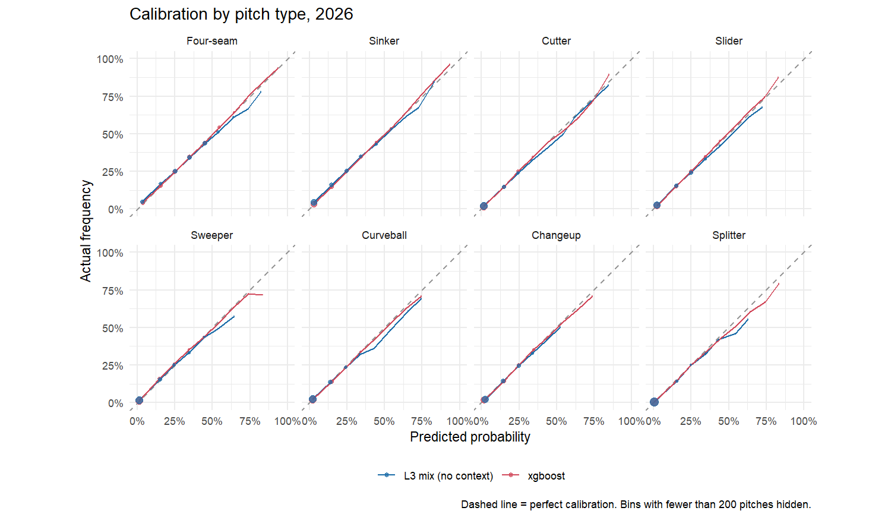

# 2026 test results

*Generated by `pipeline/10_test_2026.R` on 2026-10-08. Models refit on 2023-2025 with settings fixed on 2025, scored once on 2026, as written in [preregistration.md](preregistration.md).*

## Headline

| model | log_loss | top1 | family_log_loss | family_top1 |
|---|---|---|---|---|
| L1 prior mix (Phase 1 baseline) | 1.580 | 37.2% | 0.916 | 56.2% |
| L2 + current form | 1.417 | 39.0% | 0.888 | 56.7% |
| L3 + platoon tilt | 1.390 | 40.1% | 0.873 | 56.8% |
| Logistic, 8 pitches | 1.327 | 43.3% | 0.833 | 58.4% |
| Logistic, family then pitch | 1.349 | 42.4% | 0.831 | 58.5% |
| Logistic, 8 pitches + batter layer | 1.324 | 43.6% | 0.830 | 58.7% |
| xgboost | 1.283 | 44.7% | 0.809 | 59.7% |
| Pre-registered rule (family on relabels) | 1.327 | 43.3% | 0.833 | 58.4% |

## Which differences are real

95% intervals from 500 bootstrap resamples of games. Negative = the first model is better; an interval that excludes zero is a real difference.

| comparison | pitches | difference | lower | upper |
|---|---|---|---|---|
| L3 + platoon tilt vs. L1 prior mix (Phase 1 baseline) | 711,703 | -0.1896 | -0.1937 | -0.1863 |
| Logistic, 8 pitches vs. L3 + platoon tilt | 711,703 | -0.0636 | -0.0647 | -0.0624 |
| Logistic, 8 pitches + batter layer vs. Logistic, 8 pitches | 711,703 | -0.0032 | -0.0036 | -0.0028 |
| xgboost vs. Logistic, 8 pitches | 711,703 | -0.0439 | -0.0452 | -0.0427 |
| xgboost vs. Logistic, 8 pitches + batter layer | 711,703 | -0.0407 | -0.0420 | -0.0393 |
| xgboost vs. L1 prior mix (Phase 1 baseline) | 711,703 | -0.2971 | -0.3014 | -0.2934 |
| Pre-registered rule (family on relabels) vs. Logistic, 8 pitches | 711,703 | +0.0001 | +0.0000 | +0.0001 |
| Pre-registered rule (family on relabels) vs. Logistic, 8 pitches (relabel-repaired pitches only) | 2,456 | +0.0221 | +0.0117 | +0.0322 |

**Model the app uses (pre-registered decision rule): xgboost.**

**Pre-registered family-on-relabels rule kept: no.**

## Calibration

Average calibration error of the xgboost model by pitch type (weighted gap between predicted and actual frequency):

| class | ece |
|---|---|
| Changeup | 0.4 pts |
| Curveball | 0.3 pts |
| Cutter | 0.1 pts |
| Four-seam | 0.3 pts |
| Splitter | 0.1 pts |
| Sinker | 0.3 pts |
| Slider | 0.2 pts |
| Sweeper | 0.4 pts |

## Per pitcher (500+ pitches in 2026)

| pitchers | beat L1 (Phase 1 baseline) | beat L3 (best mix) | median gain vs L3 |
|---|---|---|---|
| 468 | 100% | 98% | 0.101 |

Biggest gains from context:

| pitcher_name | pitches | L3 log loss | model log loss | gain |
|---|---|---|---|---|
| Ryan Rolison | 990 | 1.650 | 1.331 | +0.319 |
| Yusei Kikuchi | 1,202 | 1.772 | 1.464 | +0.308 |
| Shane Baz | 2,910 | 1.531 | 1.272 | +0.259 |
| Anthony Nunez | 993 | 1.514 | 1.274 | +0.241 |
| Grant Holmes | 2,382 | 1.650 | 1.410 | +0.240 |
| Mark Leiter Jr. | 551 | 1.560 | 1.321 | +0.239 |
| Mason Montgomery | 1,169 | 1.555 | 1.317 | +0.237 |
| Jesse Scholtens | 773 | 1.603 | 1.369 | +0.234 |
| Brady Basso | 696 | 1.594 | 1.362 | +0.232 |
| Ben Brown | 1,004 | 1.357 | 1.126 | +0.231 |

Where context helps least or hurts:

| pitcher_name | pitches | L3 log loss | model log loss | gain |
|---|---|---|---|---|
| John King | 714 | 1.643 | 1.732 | -0.089 |
| Josh Ekness | 549 | 1.194 | 1.224 | -0.030 |
| Tyler Phillips | 2,037 | 1.651 | 1.675 | -0.024 |
| Josh Hader | 676 | 0.656 | 0.680 | -0.024 |
| Braydon Fisher | 1,256 | 1.102 | 1.121 | -0.019 |
| Jaden Hill | 692 | 1.397 | 1.414 | -0.017 |
| Ryan Johnson | 1,722 | 1.373 | 1.389 | -0.016 |
| Pete Fairbanks | 766 | 1.124 | 1.135 | -0.012 |
| Eduard Bazardo | 1,133 | 0.829 | 0.836 | -0.006 |
| Cade Gibson | 877 | 1.646 | 1.651 | -0.005 |

## By count

| count | L3 mix | context model | gain |
|---|---|---|---|
| 0-0 | 1.388 | 1.299 | 0.089 |
| 0-1 | 1.437 | 1.334 | 0.103 |
| 0-2 | 1.414 | 1.250 | 0.164 |
| 1-0 | 1.364 | 1.269 | 0.094 |
| 1-1 | 1.423 | 1.330 | 0.093 |
| 1-2 | 1.429 | 1.308 | 0.120 |
| 2-0 | 1.332 | 1.171 | 0.161 |
| 2-1 | 1.357 | 1.274 | 0.083 |
| 2-2 | 1.406 | 1.335 | 0.071 |
| 3-0 | 1.165 | 0.648 | 0.517 |
| 3-1 | 1.289 | 1.070 | 0.219 |
| 3-2 | 1.301 | 1.220 | 0.082 |

## By flag

| group | model | pitches | log_loss | top1 | family_top1 |
|---|---|---|---|---|---|
| mix changed | Logistic, 8 pitches | 125,209 | 1.352 | 42.8% | 60.7% |
| mix changed | Pre-registered rule (family on relabels) | 125,209 | 1.352 | 42.8% | 60.7% |
| mix changed | Logistic, family then pitch | 125,209 | 1.376 | 42.0% | 60.7% |
| mix changed | L3 + platoon tilt | 125,209 | 1.417 | 39.5% | 58.9% |
| mix changed | L1 prior mix (Phase 1 baseline) | 125,209 | 1.737 | 34.5% | 57.6% |
| relabel repaired | Logistic, 8 pitches | 2,456 | 1.253 | 45.0% | 62.4% |
| relabel repaired | Logistic, family then pitch | 2,456 | 1.275 | 44.3% | 62.1% |
| relabel repaired | Pre-registered rule (family on relabels) | 2,456 | 1.275 | 44.3% | 62.1% |
| relabel repaired | L3 + platoon tilt | 2,456 | 1.326 | 39.6% | 58.0% |
| relabel repaired | L1 prior mix (Phase 1 baseline) | 2,456 | 1.518 | 34.7% | 57.5% |
| stable | Logistic, 8 pitches | 584,038 | 1.322 | 43.4% | 57.9% |
| stable | Pre-registered rule (family on relabels) | 584,038 | 1.322 | 43.4% | 57.9% |
| stable | Logistic, family then pitch | 584,038 | 1.344 | 42.5% | 58.0% |
| stable | L3 + platoon tilt | 584,038 | 1.385 | 40.3% | 56.3% |
| stable | L1 prior mix (Phase 1 baseline) | 584,038 | 1.547 | 37.8% | 55.9% |

## By role

| group | model | pitches | log_loss | top1 |
|---|---|---|---|---|
| RP | L3 + platoon tilt | 307,846 | 1.257 | 44.5% |
| SP | L3 + platoon tilt | 403,857 | 1.492 | 36.8% |
| RP | xgboost | 307,846 | 1.148 | 49.4% |
| SP | xgboost | 403,857 | 1.386 | 41.1% |

