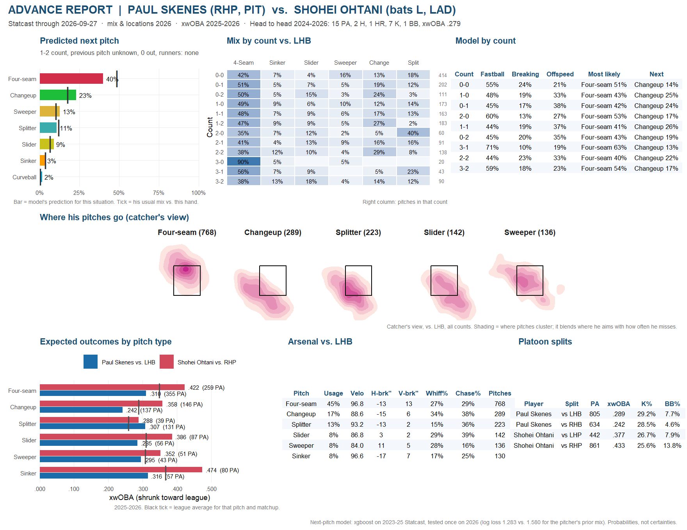

[Download the printable PDF](files/sample_skenes_ohtani.pdf){.btn .btn-primary}

{fig-alt="One-page advance report for Paul Skenes vs. Shohei Ohtani"}

## How to read it

- **Predicted next pitch.** The model's probabilities for a chosen situation (here a 1-2 count, previous pitch unknown). The tick marks his usual mix against this side, so the gap between bar and tick is what the situation adds. When earlier pitches aren't specified, the prediction averages over his likely previous pitches rather than pretending there weren't any.
- **Mix by count.** What he actually threw to left-handed hitters in each count in 2026, with the number of pitches on the right. Small cells are noisy.
- **Model by count.** The model's fastball / breaking / offspeed split and two most likely pitches in each count. This is the family view a hitter prepares for.
- **Where his pitches go.** Location density by pitch type, from the catcher's view. Public data shows where the ball ended up, not where the catcher set up, so the shading blends where he aims with how often he misses.
- **Expected outcomes by pitch type.** xwOBA for the hitter against each of the pitcher's pitch types (from pitchers of the same hand), and for the pitcher throwing them to this side, over 2025-26. Values are shrunk toward league average so small samples don't mislead; the plate appearances are shown on each bar.
- **Arsenal and platoon splits.** Velocity, movement, whiff and chase rates by pitch, and each player's splits by handedness.

## The app

The same report is a [live Shiny app](https://chrisantosiewicz.shinyapps.io/mlb-matchup-report/) where you can pick any pitcher and batter, set the situation and download the PDF. Every panel in the app and the PDF comes from the same R functions, so they always agree.
