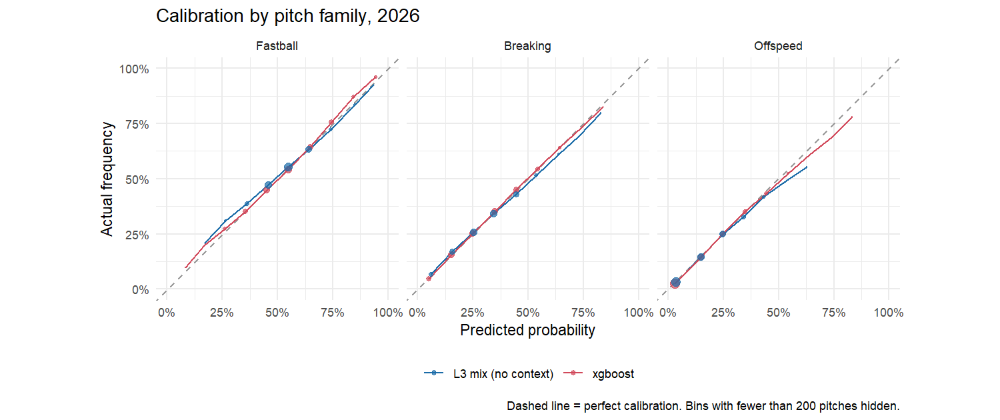
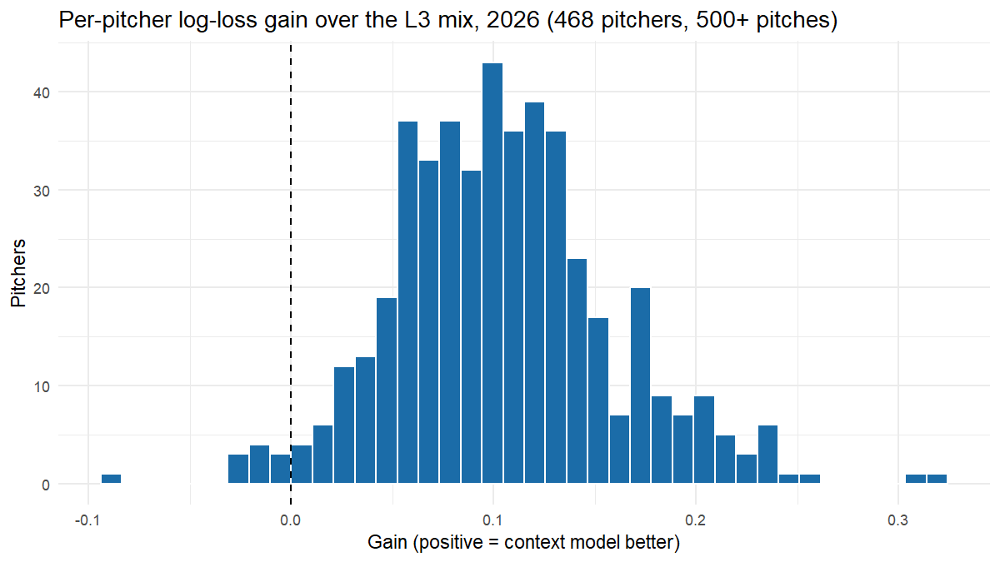

All numbers on this page come from the 2026 regular season, scored once with settings fixed on 2025. The full tables are in [test_results.md](https://github.com/chrisantosiewicz/mlb-pitch-prediction/blob/main/docs/test_results.md).

## Headline

| Model | Log loss | Top-1 | Family log loss | Family top-1 |
|---|---|---|---|---|
| Prior mix (baseline) | 1.580 | 37.2% | 0.916 | 56.2% |
| + current form | 1.417 | 39.0% | 0.888 | 56.7% |
| + platoon tilt | 1.390 | 40.1% | 0.873 | 56.8% |
| Logistic, 8 pitches | 1.327 | 43.3% | 0.833 | 58.4% |
| Logistic, family then pitch | 1.349 | 42.4% | 0.831 | 58.5% |
| Logistic + batter layer | 1.324 | 43.6% | 0.830 | 58.7% |
| **xgboost** | **1.283** | **44.7%** | **0.809** | **59.7%** |

## What each piece adds

| Step | Log-loss gain | 95% interval |
|---|---|---|
| Knowing the pitcher better (prior mix → current form + platoon) | 0.190 | 0.186 to 0.194 |
| The situation, logistic | 0.064 | 0.062 to 0.065 |
| Batter layer | 0.003 | 0.003 to 0.004 |
| Trees over logistic | 0.041 | 0.039 to 0.042 |

Most of the gain comes from knowing the pitcher's *current* mix. The situation adds a clear, real gain on top of that strong baseline. The batter layer is real but small: who's pitching and the count matter far more than who's hitting.

## Calibration

The average gap between predicted and actual frequency is 0.4 percentage points or less for every pitch type. The pitcher's mix alone (blue) is overconfident at high probabilities; the model (red) fixes that.

## Per pitcher

Of the 468 pitchers with 500+ pitches in 2026, the model beats the baseline for all of them and beats the best mix for 98%.

- **Biggest gains:** Ryan Rolison, Yusei Kikuchi and Shane Baz, all deep repertoires where count and sequence matter a lot.
- **Where it doesn't help:** John King, Josh Hader and Pete Fairbanks, mostly two-pitch relievers whose mix already says nearly everything. The model loses a little by applying league-wide count habits that don't fit them.

## By count

| Count | Mix only | Model | Gain |
|---|---|---|---|
| 3-0 | 1.165 | 0.648 | 0.517 |
| 3-1 | 1.289 | 1.070 | 0.219 |
| 0-2 | 1.414 | 1.250 | 0.164 |
| 2-0 | 1.332 | 1.171 | 0.161 |
| 1-2 | 1.429 | 1.308 | 0.120 |
| 0-1 | 1.437 | 1.334 | 0.103 |
| 1-0 | 1.364 | 1.269 | 0.094 |
| 1-1 | 1.423 | 1.330 | 0.093 |
| 0-0 | 1.388 | 1.299 | 0.089 |
| 2-1 | 1.357 | 1.274 | 0.083 |
| 3-2 | 1.301 | 1.220 | 0.082 |
| 2-2 | 1.406 | 1.335 | 0.071 |

## An idea that didn't hold up

On 2025, a family-first model (predict fastball / breaking / offspeed, then the pitch from his mix) looked better for pitchers whose pitch labels had changed. I wrote "use it for relabeled pitchers" into the test plan before scoring 2026. On 2026 it was **worse** for those pitchers (1.275 vs. 1.253 log loss, interval +0.012 to +0.032), so it was dropped. The 2025 edge came from about 2,000 pitches. The family view stays in the report because it's what a hitter prepares for.

## Limitations

- Pitch type only, not location.
- Public data only: no catcher targets, game plans or scouting reports.
- Pitch labels come from Savant's classifier, and relabels are only partly repaired.
- xgboost's interactions aren't directly readable. The logistic model is the one to explain; the trees show interactions add about as much again.
